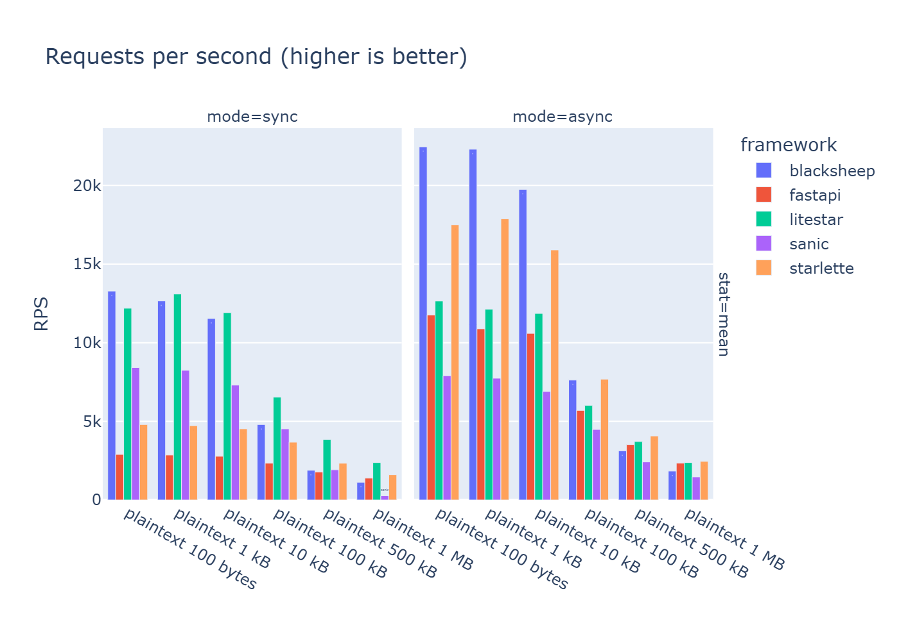
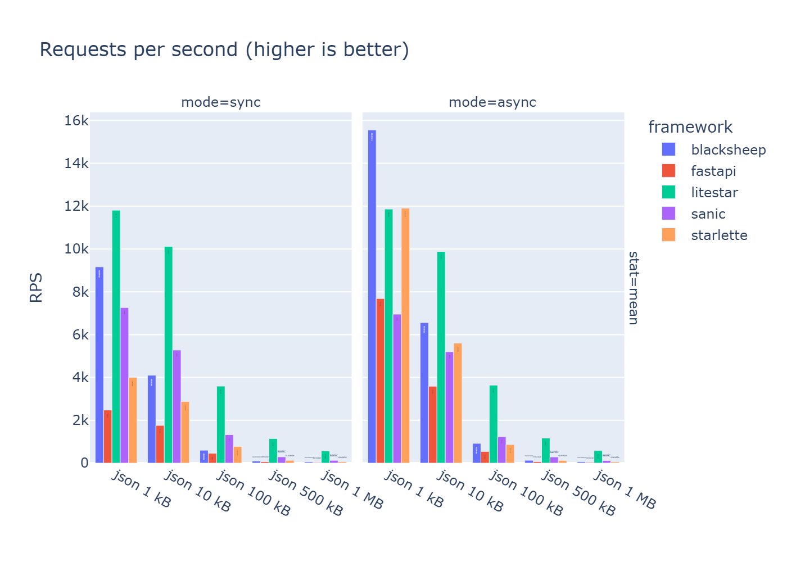
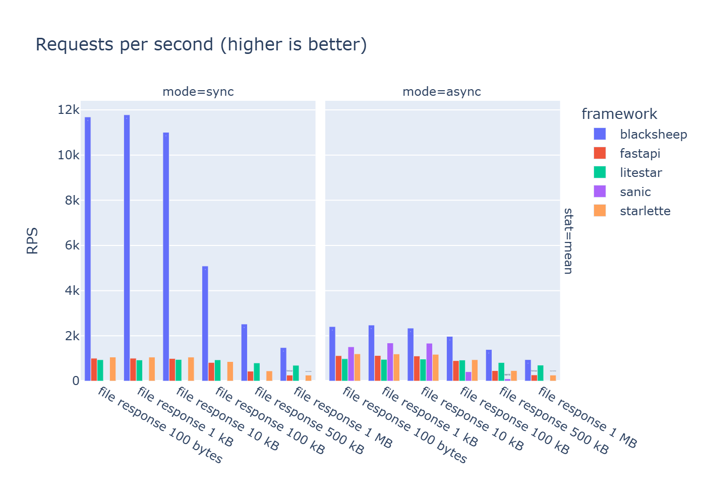
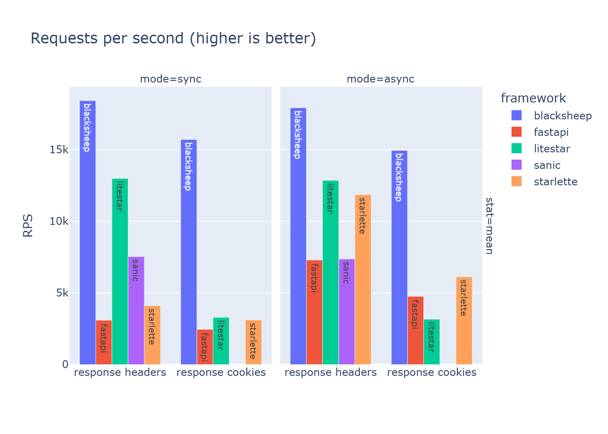
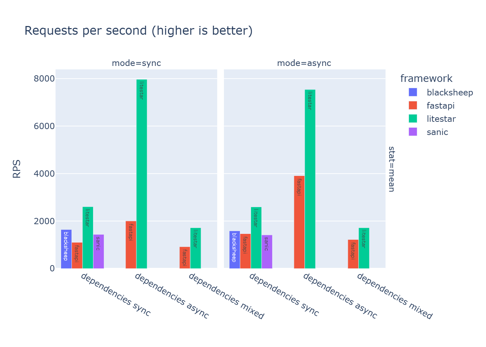
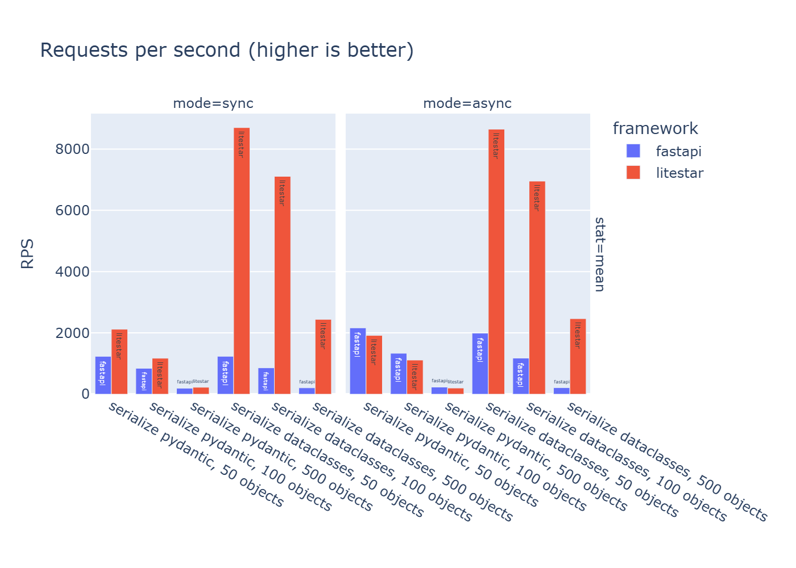
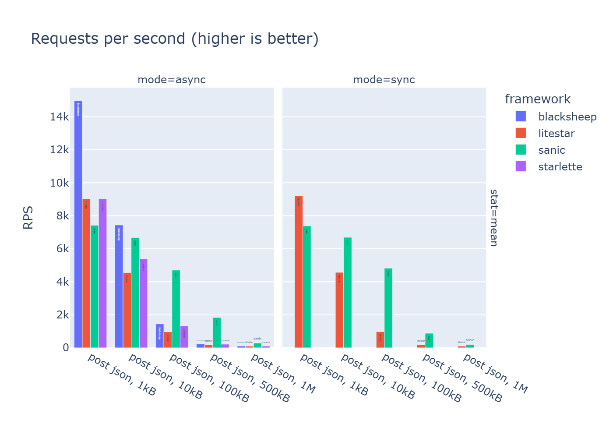
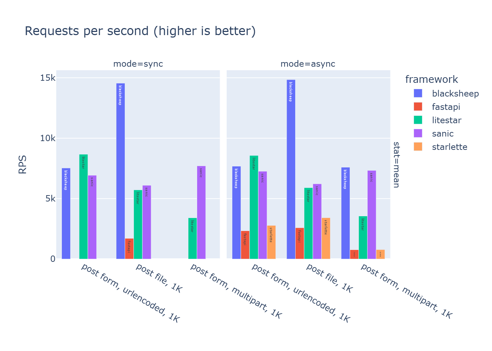

# api-performance-tests

> [!NOTE]\
> Fork notice: I forked this abandoned repository from litestar-org/api-performance-tests and managed to get it to a runnable state. I don't plan to maintain it, I just wanted to see a benchmark for different frameworks and couldn't find any. The results are in /output, but they are not good, some benchmarks failed, latency tests are completely unusable and I don't know why, but I don't care at this point. Also, it took 9 hours on my machine to run all the tests, be warned if you decide to run it.

> [!IMPORTANT]\
> [**_Starlite has been renamed to Litestar_**](https://litestar.dev/about/organization.html#litestar-and-starlite)

This is an API performance test comparing:

1. [Litestar](https://github.com/litestar-org/litestar)
2. [Starlite v1.5x](https://github.com/litestar-org/litestar/tree/v1.51)
3. [Starlette](https://github.com/encode/starlette)
4. [FastAPI](https://github.com/tiangolo/fastapi)
5. [Sanic](https://github.com/sanic-org/sanic)
6. [BlackSheep](https://github.com/Neoteroi/BlackSheep)

Using the [bombardier](https://github.com/codesenberg/bombardier) HTTP benchmarking tool.

## RPS Test Results

WARNING: some runs failed, ran on python 3.11, I don't understand this benchmark and may have messed up things that causes results to be inaccurate.

### Plaintext

### JSON

### Files

### Parameters

### Dynamic Response

### Dependency Injection

### Serialization

### Post JSON

### Post Body

## Test Setup

Setup is identical for all frameworks.

- Applications reside in the `frameworks` folder and consist of a single file named `<framework_name>_app.py`

### Tests

All tests are run sync and async

#### Serialization and data sending

##### Plaintext

- Sending 100 bytes plaintext
- Sending 1kB plaintext
- Sending 10kB plaintext
- Sending 100kB plaintext
- Sending 500kB plaintext
- Sending 1MB plaintext
- Sending 5MB plaintext

##### JSON

Serializing a dictionary into JSON

- Serializing and sending 1kB JSON
- Serializing and sending 10kB JSON
- Serializing and sending 100kB JSON
- Serializing and sending 500kB JSON
- Serializing and sending 1MB JSON

##### Serialization

(only supported by `Litestar`, `Starlite`, and `FastAPI`)

- Serializing 50 dataclass objects each referencing 2 more dataclass objects
- Serializing 100 dataclass objects each referencing 5 more dataclass objects
- Serializing 500 dataclass objects each referencing 3 more dataclass objects
- Serializing 50 pydantic objects each referencing 2 more pydantic objects
- Serializing 100 pydantic objects each referencing 5 more pydantic objects
- Serializing 500 pydantic objects each referencing 3 more pydantic objects

##### Files

- Sending a 100 bytes binary file
- Sending a 1kB bytes binary file
- Sending a 50kB binary file
- Sending a 1MB bytes binary file

#### Path amd query parameter handling

All responses return "No Content"

- No path parameters
- Single path parameter, coerced into an integer
- Single query parameter, coerced into an integer
- A path and a query parameters, coerced into integers

#### Dependency injection

(not supported by `Starlette`)

- Resolving 3 nested synchronous dependencies
- Resolving 3 nested asynchronous dependencies (only supported by `Litestar`, `Starlite`, and `FastAPI`)
- Resolving 3 nested synchronous, and 3 nested asynchronous dependencies (only supported by `Litestar`, `Starlite`, and `FastAPI`)

#### Modifying responses

All responses return "No Content"

- Setting response headers
- Setting response cookies

## Running the tests

### Prerequisites

- [docker](https://docs.docker.com/get-docker/)
- [poetry](https://python-poetry.org/docs/#installation)
- Python 3.11

### Running tests

1. Clone this repo
2. Run `poetry install`
3. Run tests with `poetry run bench run --rps --latency`

After the run, the results will be stored in `results/run_<run_mumber>.json`

#### Selecting which frameworks to test

To select a framework, simply pass its name to the `run command`:

`bench run --rps litestar starlite starlette fastapi`

##### Selecting a framework version

- A version available on PyPi: `bench run --rps litestar@v2.0.0`
- A version from git: `bench run --rps litestar@git+branch_or_tag_name`
- A version from a specific git repository: `bench run --rps litestar@git+https://github.com/litestar-org/litestar.git@branch_or_tag_name`
- A local file: `bench run --rps litestar@file+/path/to/litestar`

#### Running a specific test

You can run a single test by specifying its full name and category:

`bench run --rps litestar -t json:json-1K`

#### Test Settings

|                                                                                                                                                                       |                                                                 |
| --------------------------------------------------------------------------------------------------------------------------------------------------------------------- | --------------------------------------------------------------- |
| -r, --rebuild                                                                                                                                                         | rebuild docker images                                           |
| -L, --latency                                                                                                                                                         | run latency tests                                               |
| -R, --rps                                                                                                                                                             | run RPS tests                                                   |
| -w, --warmup                                                                                                                                                          | duration of the warmup period (default: 5s)                     |
| -e, --endpoint mode [sync&#124;async]                                                                                                                                 | endpoint types to select (default: sync, async)                 |
| -c, --endpoint-category [plaintext&#124;json&#124;files&#124;params&#124;dynamic-response&#124;dependency-injection&#124;serialization&#124;post-json&#124;post-body] | test types to select (default: all)                             |
| -d, --duration                                                                                                                                                        | duration of the rps benchmarks (default: 15s)                   |
| -l, --limit                                                                                                                                                           | max requests per second for latency benchmarks (default: 20)    |
| -r, --requests                                                                                                                                                        | total number of requests for latency benchmarks (default: 1000) |

### Analyzing the results

- Run `bench results` to generate plots from the latest test results
- Run `bench results -s` to generate plots from the latest test results and split them into separate files for each category

## Contributing

PRs are welcome.

Please make sure to install [pre-commit](https://pre-commit.com/) on your system, and then execute `pre-commit install`
in the repository root - this will ensure the pre-commit hooks are in place.

After doing this, add a PR with your changes and a clear description of the changes.
